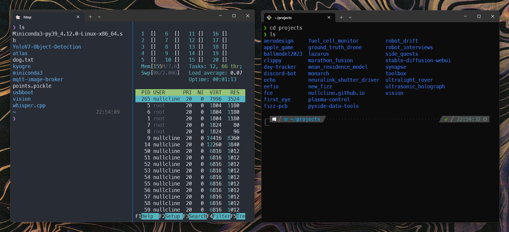

### CLI
i like windows - i can run my primary engineering softwares (solidworks, altium) and have very minimal compatibility issues when it comes to flashing firmware and other peripheral related things. it also lets me run things like adobe photoshop/premiere pro without WINE, and also lets me game to my heart's content. if i ever really need linux-y stuff, WSL2 is great or i'll just partition my harddrive/get an external one.

my preferred software dev tools on windows are vscode for almost all actual programming (python, rust, c++, c, even embedded stuff), although i've been playing around with cursor. for my terminal i really like the built in windows terminal - it lets me run various different types of terminals (BASH emulation, WSL2, default windows terminal, powershell), and plays well with thinks like _oh my bash_ and _oh my zsh_, (this repo is partially to store my .bsrhc/.zshrc files)

### Python Scripts
i'll update this one day maybe, this became a lot less useful when GPT-4 came out
